# disk类型镜像启动流程

# initrd阶段

本阶段的init程序为[init脚本](../images/disk/init)。

该阶段所有程序都在initrd环境中运行，该阶段主要工作是open并mount luks2系统盘。本阶段最后一步使用`switch_root`命令(必须要以`pid 1`运行)来切换根目录和init程序。

# disk阶段

本阶段的init程序为busybox的init applet，busybox的一个软链接。

该init程序默认配置下会在启动时执行[/etc/init.d/rcS](../images/disk/rcS)。